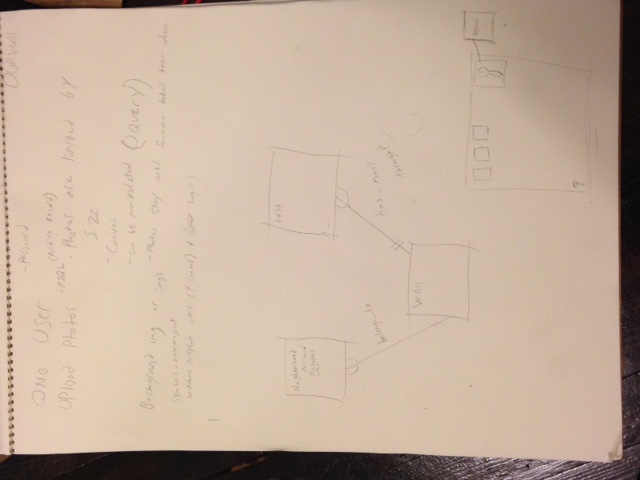
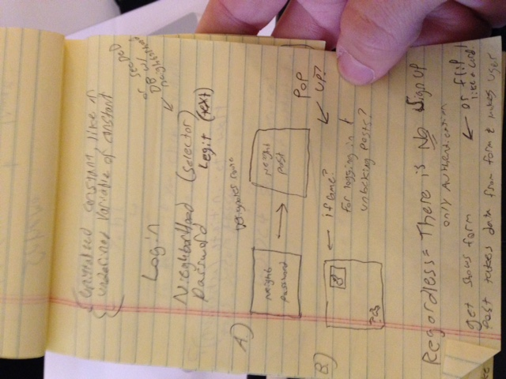

Project #1 - OurWall Sketch

Overview

OurWall is a visual public forum for your neighborhood!

Tech

Ruby

Sinatra
Heroku - 2.1.2
PostgreSQL
HTML & CSS

User Stories
-User can verify neighborhood affiliation
-User can post pictures
-User can delete pictures

What didn't make the cut this version
-Grafitti function with "<canvas>"
-Pictures are interactive
-Different neighborhoods have different posts

ERD

